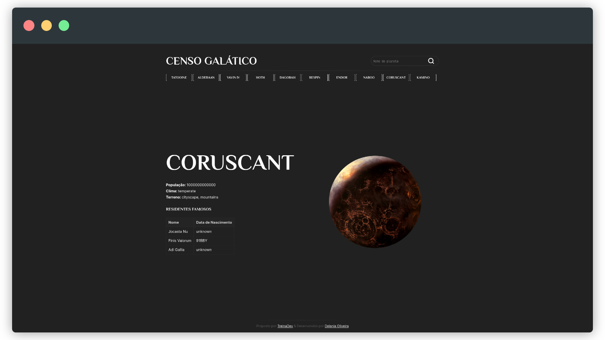

# Censo Galático

#### Visualização

#### Sobre

O projeto visa construir uma aplicação web utilizando as tecnologias HTML e JS capaz de consumir uma API REST para consultar dados vindos de 2 APIs públicas. 

---
Proposto pelo programa [TreinaDev](https://treinadev.com.br/)
